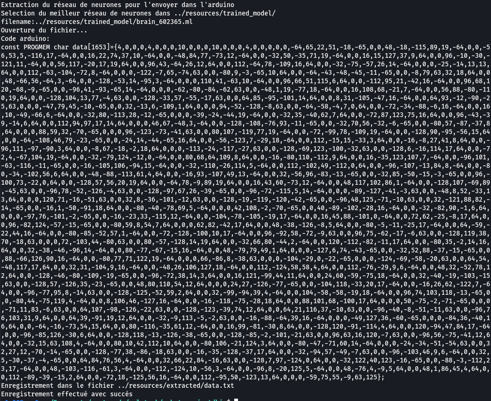
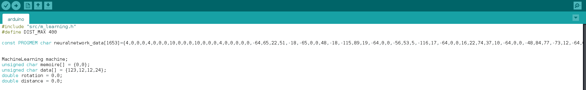

<h1>MACHINE LEARNING ARDUINO</h1>

It is a library which can be implemented in an ARDUINO 
You can train your neuralnetwork with your computer with the Machine learning algorithm 
You can find in src or in my other repository in my github 
<h3>Train your neural network</h3>

You train your neural network on your computer, it's the first step 

<h3>Extract the neural network</h3>

When you have finished your training, you will be able to launch the command 
<code> ~$ ./extract_nn ./model/brain.ml</code> 
It will extract all the information in a line, you will just paste in your arduino editor 

<h3>Implementation on arduino</h3>

Once you have done the previous step, you have to import the library m_learning for arduino in the folder arduino. 
And after that you will be able to use your neural network on your arduino !

Have fun !